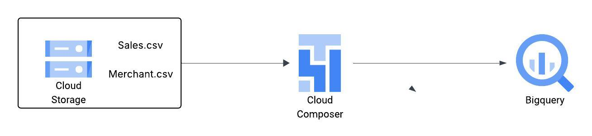

# Walmart-Data-Ingestion
Walmart Sales Data Ingestion in Big Query with upsert using merge

## Introduction
This industrial project builds a data pipeline to ingest Walmart sales data using Google Cloud Platform. The pipeline is orchestrated using Apache Airflow, where BigQuery Operators are used to dynamically create dimension and staging tables during runtime. Sales and merchant data stored in GCP Cloud Storage is loaded into BigQuery, where an Airflow task performs a join between the staging and dimension tables and upserts the results into a fact table using a BigQuery MERGE query for efficient data integration and reporting.

## Architecture

## Technology Used
1. Programming language - Python
2. Scripting Language - SQL
3. Google Cloud Platform
   - BigQuery
   - Cloud Storage
   - Composer (Managed Workflow Orchestration Service)
  
## Dataset Used
A Python mock data generator that publishes passenger related data such as name, age, email, join date, loyalty points, account balance, is active, loyalty status, account age days into Pub/Sub.
  
## Scripts for the Project
1. [Airflow DAG File](airflow_bigquery_dag.pyy)

